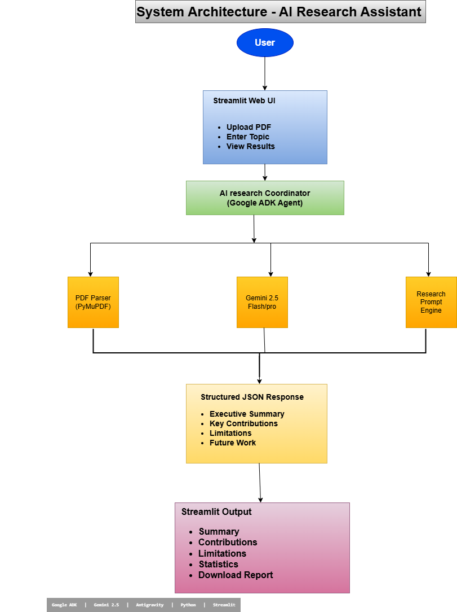
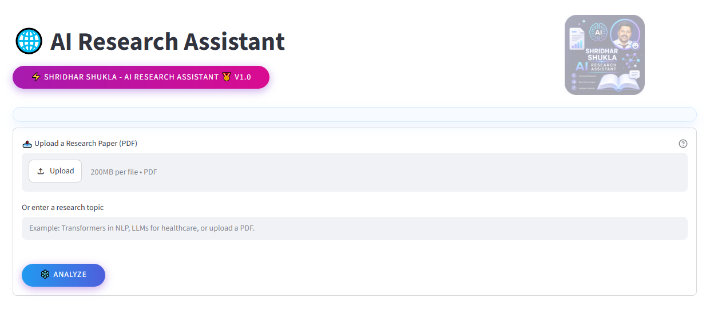
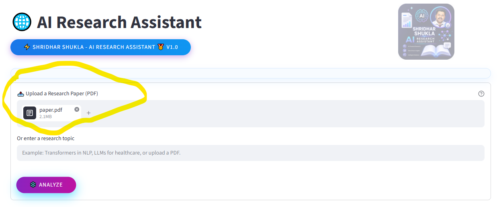
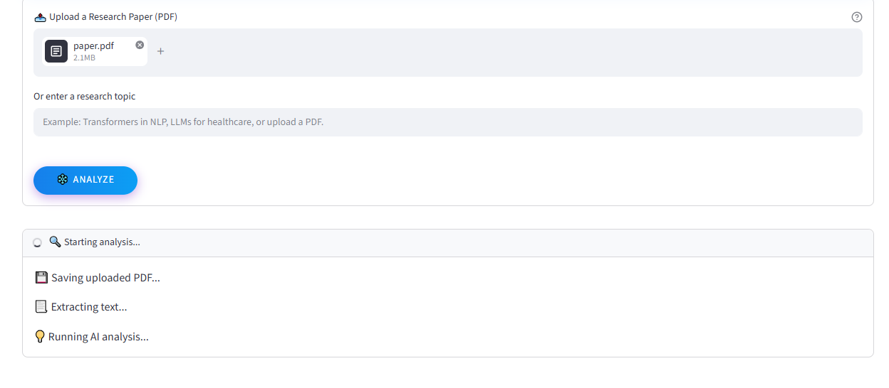
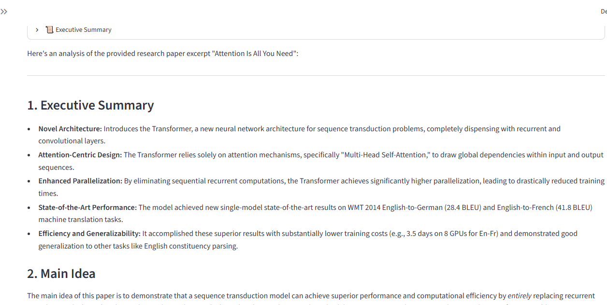
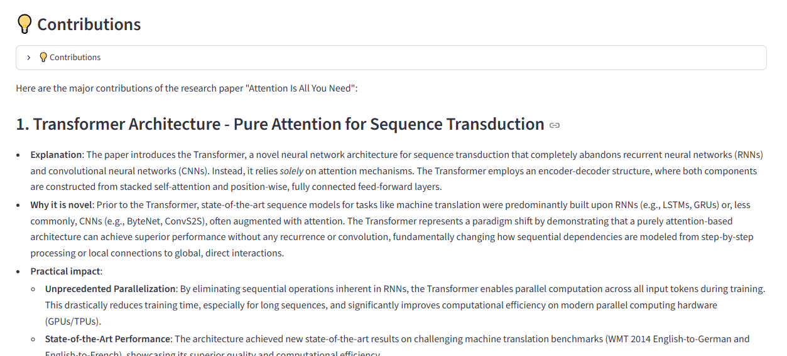
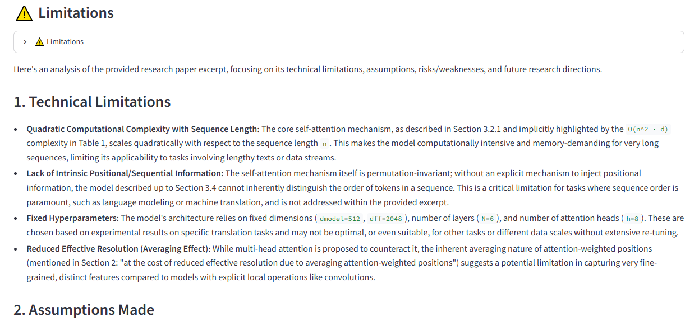
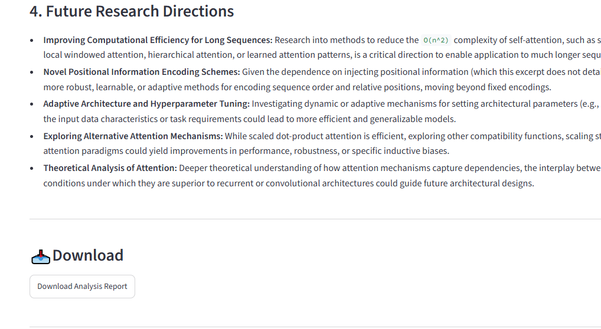
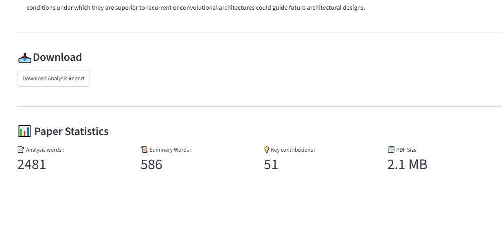
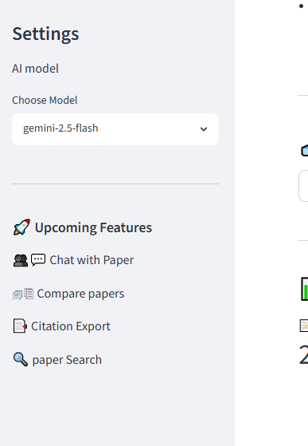

# ai-research-assistant-agent
Multi-agent AI Research Assistant built using Google ADK, Antigravity and MCP to analyze research papers, identify research gaps and suggest future work.

<p align="center">


</p>

# AI Research Assistant Agent

## Overview

AI Research Assistant Agent is a **Multi-Agent AI system** that helps researchers and students analyze research papers, identify key contributions, extract limitations, discover research gaps, and generate future research directions.

Upload a research paper PDF or provide a research topic, and specialized AI agents collaborate to produce:

- 📄 Executive Summary
- ⭐ Key Contributions
- ⚠️ Research Limitations
- 💡 Research Gaps
- 🚀 Future Research Directions

The project demonstrates **Agentic AI**, **Google ADK**, **Gemini**, **MCP**, and **Antigravity-assisted UI design**.

---

## Problem Statement

Reading and understanding research papers is time-consuming. Researchers often spend significant effort summarizing papers, comparing literature, identifying gaps, and finding promising future work.

This project uses AI agents to automate parts of the research workflow and help users understand papers more efficiently.

# ✨ Features

- 📄 Upload Research Paper PDFs
- 🔍 Research Topic Analysis
- 🤖 Multi-Agent Architecture
- 📚 Executive Summary Generation
- ⭐ Contribution Extraction
- ⚠️ Limitation Detection
- 💡 Research Gap Identification
- 🚀 Future Work Suggestions
- 📊 Paper Statistics
- 📥 Download Analysis Report
- 🎨 Modern Streamlit Dashboard

---

# 🏗️ System Architecture




---

# 🤖 Multi-Agent Workflow

### 📄 PDF Agent

Extracts text from uploaded research papers.

---

### 📚 Summary Agent

Generates concise executive summaries.

---

### ⭐ Contribution Agent

Identifies the key research contributions.

---

### ⚠️ Limitation Agent

Finds limitations and possible weaknesses.

---

### 🧠 Coordinator Agent

Routes requests, orchestrates agents, and combines outputs into one structured report.

---

# 🖥️ User Interface

Features include

- Professional Dashboard
- Sidebar Navigation
- Paper Statistics
- Upload Card
- Creative Analyze Button
- Download Report
- Expandable Analysis Sections

*(Screenshots will be added here.)*

---

# 🛠️ Technology Stack

| Category | Technology |
|-----------|------------|
| Language | Python |
| AI Framework | Google ADK |
| LLM | Gemini 2.5 Flash |
| Agent UI Design | Antigravity |
| Protocol | MCP |
| Frontend | Streamlit |
| PDF Processing | PyPDF |
| Environment | python-dotenv |

---

# 📁 Project Structure

```text
AI-Research-Assistant/

│

├── agents/

│ ├── coordinator/

│ ├── pdf_agent/

│ ├── summary_agent/

│ ├── contribution_agent/

│ ├── limitation_agent/

│

├── docs/

├── app.py

├── requirements.txt

├── README.md

└── .env
```

---

# 🚀 Installation

```bash
git clone <repository>

cd AI-Research-Assistant
```

Install dependencies

```bash
pip install -r requirements.txt
```

Run

```bash
python -m streamlit run app.py
```

---

# 📸 Screenshots

### Home Dashboard

*Home - dashboard.*

### Upload section

*Upload area.*

### Analysis running

*Analysis running.*

### Executive Summary

*AI-generated executive summary of the uploaded research paper.*

### Key Contributions

*Key contributions of the research paper.*

### Limitations

*Limitations of the research paper.*

### Download Report

*Download your final analysis.*

### Paper Statistics

*Paper Statistics.*

### Sidebar & Upcoming Features

*Upcoming features.*


---

# 🎥 Demo Video

*(YouTube link will be added after recording.)*

---

# ☁️ Deployment

*(Coming Soon (Google Cloud run).)*

---

# 🔮 Future Roadmap

- 📑 Multi-paper Comparison
- 💬 Chat with Research Papers
- 📈 Literature Review Generation
- 🌐 arXiv Integration
- 🧠 Research Trend Analysis
- 🔍 Semantic Search
- 📚 Citation Network Visualization

---

# 🏆 Kaggle AI Agents Capstone

This project was developed as part of the **Kaggle 5-Day AI Agents: Intensive Vibe Coding Course with Google**.

It demonstrates:

- Google ADK
- Agent Orchestration
- Antigravity-assisted UI Design
- MCP Integration
- Gemini-powered AI Agents
- Streamlit Dashboard

---

# 👨‍💻 Developer

**Shridhar Shukla**

AI • Data Science • Machine Learning • Research

---

# ⭐ If you found this project useful...

Please consider giving it a ⭐ on GitHub!

## Status

🚧 In Development